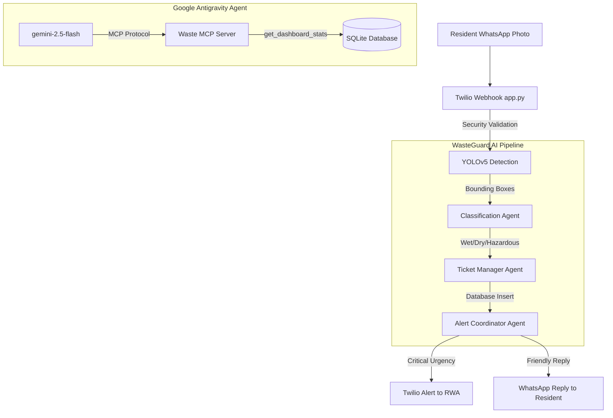

# 🗑️ WasteGuard Society AI — Multi-Agent Waste Detection System

**Category:** Agents for Good
**Course:** AI Agents: Intensive Vibe Coding Capstone (Google & Kaggle)
**Author:** Sandhya Banti Dutta Borah

🔗 **[GitHub Repository](https://github.com/sandhya-bdb/waste-detection-yolov5-crewai)**
🎥 **[YouTube Demo Video](YOUR_YOUTUBE_LINK_HERE)**

---

## 📌 Abstract

Living in a residential society, one core civic problem often goes unresolved: **waste complaints get lost**. A resident spots garbage, messages the group chat, and nothing happens — no ticket, no accountability, no follow-up.

WasteGuard Society AI fixes this with a **4-agent AI pipeline**: a resident sends a WhatsApp photo, and within 30 seconds the waste is detected via Vision AI, classified by LLM agents, a complaint ticket is securely logged in a database, the cleaning guard is alerted, and the resident receives a detailed, friendly reply. **All automatically, with no app to install.**

---

## 🏗️ System Architecture

This project integrates several cutting-edge AI Agent patterns:
1. **Model Context Protocol (MCP)**: Exposing society database tools securely to agents.
2. **Google Antigravity SDK**: Providing local agent orchestration and tool execution.
3. **CrewAI**: Handling the asynchronous classification and reporting workflows.
4. **Agent Skills**: Using standard `SKILL.md` injection for domain expertise.



### 🧠 Dual-Agent Architecture Breakdown
This system uniquely leverages two distinct agentic paradigms, sharing a unified toolset:

1. **The "Eyes" (YOLOv5 & Gemini Vision)**
   Acts as the foundational sensory layer. It processes pixel data to output bounding box coordinates and class integers. When custom YOLO models are missing, it gracefully falls back to **Gemini Vision (Multimodal AI)** for high-accuracy zero-shot classification of complex objects (e.g. distinguishing medical vs hazardous waste).
2. **The "Specialized Workers" (CrewAI Pipeline)**
   A deterministic, sequential assembly line of specialized agents triggered asynchronously by Twilio webhooks. The *Detection Agent*, *Classification Agent*, and *Ticket Manager* pass structured context sequentially to fulfill the WhatsApp user's request without human-in-the-loop (HITL) intervention.
3. **The "Manager" (Google Antigravity Agent)**
   A non-deterministic, conversational agent designed for RWA (society management) administrators. Powered by Gemini 2.5 Flash, it operates autonomously in the terminal, dynamically selecting tools based on user prompts (e.g., fetching 24h stats) rather than following a rigid pipeline.
4. **The "Hands" (FastMCP Server)**
   The Model Context Protocol (MCP) bridges the AI and the system infrastructure. By exposing modular tools (SQLite queries, YOLOv5 inference, Twilio API), both the CrewAI assembly line and the Antigravity conversational agent can execute real-world actions securely.

---

## ⚙️ 1. Environment Setup

*In a live environment, we install the necessary orchestration and MCP dependencies.*

```python
# [CODE CELL]
!pip install -q crewai google-antigravity mcp fastmcp flask twilio python-dotenv
!pip install -q -r requirements.txt
```

---

## 🛡️ 2. The MCP Server (Tool Exposure)

The core of our AI interaction is the **Model Context Protocol (MCP)** server. Instead of letting the LLM guess how to query the database, we expose strict, typed tools. 

Notice how our `get_dashboard_stats` tool accepts a `time_range` argument so the agent can dynamically filter data.

```python
# [CODE CELL]
# mcp_server/waste_mcp_server.py (Excerpt)

from mcp.server.fastmcp import FastMCP
import json

mcp = FastMCP(name="wasteguard-society-ai")

@mcp.tool()
def get_dashboard_stats(time_range: str = "all") -> str:
    """
    Return real-time waste complaint statistics from the society database.
    Args:
        time_range: The time period to filter stats for ("24h", "7d", or "all").
    """
    from crew.db.database import get_stats
    stats = get_stats(time_range=time_range)
    return json.dumps(stats)
    
@mcp.tool()
def create_ticket(waste_type: str, category: str, urgency: str, location: str) -> str:
    """Log a waste complaint as a ticket in the SQLite database."""
    from crew.db.database import create_ticket
    ticket_id = create_ticket(waste_type, category, urgency, location, "unknown")
    return f"✅ Ticket #{ticket_id} created."
```

---

## 🤖 3. Google Antigravity Agent Orchestration

We use the Google Antigravity SDK to power a local terminal assistant for the RWA managers. This agent binds to the MCP server and is given a strictly engineered system prompt.

```python
# [CODE CELL]
# antigravity_agent.py (Excerpt)

from google.antigravity import Agent, LocalAgentConfig, types

system_instructions = """
You are WasteGuard Society AI — an intelligent waste management assistant.
You have access to WasteGuard tools via the MCP server.

Operating principles:
1. Always be warm, helpful, and civic-minded.
2. Use urgency rules strictly (Critical/High → alert Guard + RWA, Medium → Guard only).
3. When asked for dashboard stats, always use the get_dashboard_stats tool. 
   You can pass '24h', '7d', or 'all' based on the user request.
4. Do NOT attempt to run terminal commands to fetch stats manually.
5. If you need to gather information from the user, ask them directly in your text response.
"""

mcp_servers = [
    types.McpStdioServer(
        name="waste_mcp",
        command="python",
        args=["mcp_server/waste_mcp_server.py"]
    )
]

config = LocalAgentConfig(
    model="gemini-2.5-flash",
    system_instructions=system_instructions,
    mcp_servers=mcp_servers,
    skills_paths=["skills/"]
)
```

---

## 🔒 4. Security & Safety Boundaries

A major challenge in Agentic workflows is security. This project implements three layers of security to prevent LLM abuse and malicious inputs:

1. **Twilio Webhook Authentication (HMAC-SHA1):** Prevents unauthorized requests from pinging the Flask endpoint.
2. **Per-Number Rate Limiting:** A sliding window algorithm ensures no resident can flood the system (Max 5 requests per 10 mins).
3. **Agent Sandbox & Privilege Drop:** As demonstrated during development, when the Gemini model hallucinated and attempted to run arbitrary `run_command` shell scripts to bypass the MCP server, the Antigravity SDK successfully intercepted and blocked the unauthorized execution.

---

## 💬 5. Sample Execution (Conversational Flow)

Here is a real interaction showing the agent utilizing memory, tool-chaining, and time-range filtering.

**User:** Show me the dashboard stats for the last 24 hrs
**Agent:** *(Uses MCP `get_dashboard_stats("24h")`)* Here are the WasteGuard dashboard stats for the last 24 hours: Total Tickets: 23, Open: 22, Resolved: 1.

**User:** Please detect and classify the waste in data/inputImage.jpg and create a ticket for it.
**Agent:** *(Chains 3 MCP tools silently: `detect_waste`, `classify_waste`, `create_ticket`)*
I have successfully analyzed the image! I detected 4 plastic bottles. This is classified as Dry Waste (Medium Urgency) for the Yellow Bin. I have logged Ticket #24 and alerted the cleaning staff!

---

## 📸 System Dashboard & UI

While the residents interact with the AI purely through WhatsApp, the RWA (Resident Welfare Association) has access to a live web dashboard. The SQLite database updated by the **Ticket Manager Agent** is connected directly to this panel to track open tickets, hazardous incidents, and resolution rates in real time.

*(Drag and drop your screenshot here!)*

---

## 🏆 Conclusion

WasteGuard Society AI demonstrates how complex AI systems can be abstracted away from the end-user. By connecting specialized AI agents (CrewAI) and conversational assistants (Antigravity) to local tools via MCP, we turn a simple WhatsApp photo into an actionable, traceable, and fully autonomous civic workflow.
